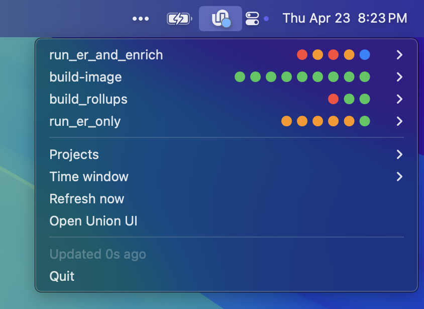

# Union Status — macOS menu bar app



A small Mac app that displays the health of your Union.ai cluster as a
menu bar icon. Built against the Flyte v2 SDK (`flyte` package).

## Menu bar icon

The Union.ai "U" logo with a small colored dot in the bottom-right corner:

- 🟢 **green** — most recently finished run succeeded
- 🔵 **blue** — at least one run is in progress
- 🟠 **orange** — most recently finished run was aborted
- 🔴 **red** — most recently finished run failed (or timed out)
- 🟣 **purple** — something is queued / waiting for resources
- ○ — no runs in the selected window

The dot always reflects the *filtered* view (selected projects × selected
time window).

## Menu contents

Top of the menu: one row per task (workflow function) in the window. Each
row shows the task name plus a strip of up to 10 flat colored dots — the
status of the last N runs, oldest on the left, newest on the right.

- Click a row to jump straight to the **latest** run in the Union v2 console.
- Hover the row to expand a submenu of every run in the group; click any
  run to open just that one.

Below the run list:

- **Projects ▶** — checkable list of every `{project}/{domain}` on the
  cluster. Toggle to add/remove from the view.
- **Time window ▶** — radio-style picker: last 1h / 6h / 12h / 24h / 3d /
  1w / Ever. A run counts if it's currently in progress *or* it started or
  ended inside the window. Default: 24 hours.
- **Refresh now** — force an immediate poll.
- **Open Union UI** — opens your first selected project in the v2 console.

At the very bottom: when the data was last refreshed.

Auto-refreshes every 60 seconds.

## Authentication and defaults

Credentials and the default project/domain are read from
`~/.union/config.yaml` — the same file the `union` CLI uses. No keys or
endpoints live in this repo.

On first launch the app seeds its filter from the `task.project` and
`task.domain` keys in that file (e.g. `onboarding/development`). After
that your picks live in `~/.config/union-status/config.json` and persist
across launches.

## Running

```bash
uv run python main.py
```

To run detached so it survives terminal close:

```bash
nohup uv run python main.py >/tmp/union-status.log 2>&1 &
```

## Launch at login (macOS)

A `launchagent.plist` template is included. It uses launchd so macOS starts
the app at login and restarts it if it crashes.

1. Copy the template and pick a unique label (reverse-DNS is convention):
   ```bash
   LABEL=com.$(whoami).union-status
   cp launchagent.plist ~/Library/LaunchAgents/$LABEL.plist
   ```

2. Fill in the placeholders in that file:
   - `REPLACE_WITH_ABS_PATH_TO_REPO` → `pwd` of this checkout
   - `REPLACE_WITH_ABS_PATH_TO_UV` → output of `which uv`
   - `REPLACE_WITH_YOUR_HOME` → output of `echo $HOME`
   - Change the `Label` string to match `$LABEL`

   One-liner (BSD/macOS `sed`):
   ```bash
   sed -i '' \
     -e "s|REPLACE_WITH_ABS_PATH_TO_REPO|$(pwd)|g" \
     -e "s|REPLACE_WITH_ABS_PATH_TO_UV|$(which uv)|g" \
     -e "s|REPLACE_WITH_YOUR_HOME|$HOME|g" \
     -e "s|com.example.union-status|$LABEL|g" \
     ~/Library/LaunchAgents/$LABEL.plist
   ```

3. Load it into launchd:
   ```bash
   launchctl load -w ~/Library/LaunchAgents/$LABEL.plist
   ```

4. Verify (the first column is the PID when running, `-` when stopped):
   ```bash
   launchctl list | grep union-status
   tail -f ~/Library/Logs/union-status.log
   ```

### Managing the agent

```bash
# Stop it now (won't relaunch until next login or reload)
launchctl unload ~/Library/LaunchAgents/$LABEL.plist

# Start it again without rebooting
launchctl load -w ~/Library/LaunchAgents/$LABEL.plist

# Remove entirely
launchctl unload ~/Library/LaunchAgents/$LABEL.plist
rm ~/Library/LaunchAgents/$LABEL.plist
```

After editing `main.py` you need to `unload` and `load` the agent (or just
`kill` the Python process — launchd will relaunch it thanks to `KeepAlive`).

## Tunables

A few knobs live at the top of [main.py](main.py):

- `REFRESH_SECONDS` — poll interval (60s by default)
- `RECENT_LIMIT_PER_DOMAIN` — how many runs to fetch per project/domain per
  refresh (default 100, sorted newest-first)
- `TOTAL_SHOWN` — max task groups displayed in the menu
- `DOT_STRIP_MAX` — max dots per group row
- `TIME_WINDOWS` / `DEFAULT_WINDOW_LABEL` — edit the time-window submenu

## License

MIT — see [LICENSE](LICENSE).
